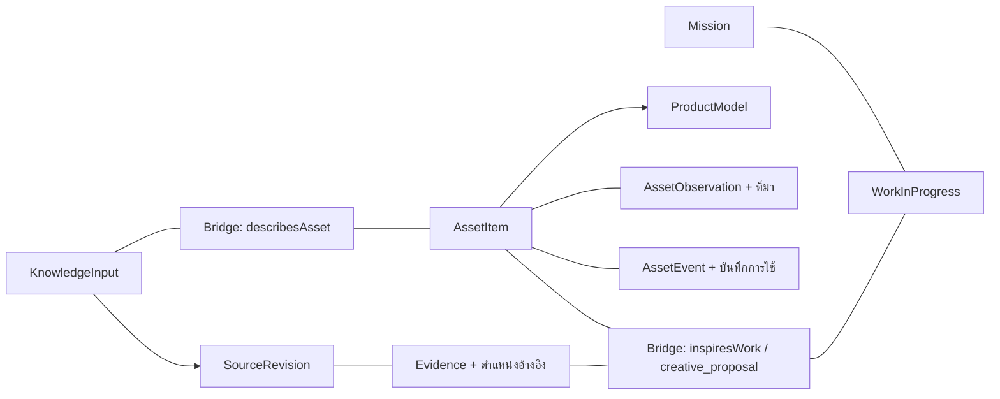

# My Assets Ontology v1.0.0

สถานะ: โมเดลนำร่องสำหรับเจ้าของ ใช้งานแบบ private/draft ยังไม่เชื่อมเข้าระบบ KG จริง
วันที่: 26 กันยายน 2026

ออกแบบเพื่อสองภารกิจ: บริหารทรัพย์สินส่วนตัว และใช้ความรู้จากทรัพย์สิน/การใช้งานเป็นต้นทางสร้างคอนเทนต์ ไม่ต้องกรอกครบทุกฟิลด์ ไม่ใช้จำนวนข้อมูลเป็นตัววัดความสำเร็จ

## สถาปัตยกรรม

ใช้โมดูล Assets แยกจาก Core พร้อม Bridge ที่มีเวอร์ชันของตัวเอง เพิ่มโดเมนในอนาคตได้โดยไม่ขยาย Core ให้รวมรายละเอียดทุกประเภท

- **Core**: Mission, KnowledgeInput, SourceRevision, Evidence, Question, WorkInProgress และกติกาทบทวนข้อมูลเดิม
- **Assets**: สิ่งของ รุ่นสินค้า ฉบับเผยแพร่ เหตุการณ์ และค่าที่บันทึกพร้อมที่มา
- **Bridge**: ความสัมพันธ์จากต้นทางความรู้ถึงทรัพย์สิน จากชิ้นหลักถึงส่วนประกอบ และจากทรัพย์สินถึงไอเดียคอนเทนต์
- **Concept scheme**: ใช้ 55 concepts จาก Thesaurus เดิม โดยรักษา URI, broader, related และ relatedMatch ไม่แปลง broader ทุกเส้นเป็น OWL subclass และไม่แปลง relatedMatch เป็น sameAs

เส้นในภาพเป็นภาพรวมการใช้งาน ไม่ได้แสดงชื่อ predicate ทุกเส้นตาม RDF

## สิ่งที่โมเดลแยกให้ชัด

| Class | ความหมายและการใช้ |
|---|---|
| AssetRecord | รายการฐานในโมดูล รวมชื่อ ผู้บันทึก เวลา สถานะทบทวน และการเข้าถึง |
| AssetItem | วัตถุรายชิ้นที่ติดตาม ไม่ได้หมายความว่ามีหลักฐานเป็นเจ้าของแล้ว |
| Component | ส่วนประกอบที่ต้องการติดตามแยกเป็นชิ้น เช่น ใบกบหรือเลนส์ที่ถอดเปลี่ยนได้ |
| ProductModel | รุ่นผลิตภัณฑ์ รายละเอียดจากผู้ผลิตไม่ควรถูกคัดลอกเป็นค่าที่วัดจากทุกชิ้น |
| BrandRecord | แบรนด์ แยกจากบริษัทหรือบุคคล |
| AgentRecord | บุคคล/องค์กร เช่น ผู้สร้าง ผู้ผลิต ผู้ขาย |
| ReleaseGroup | กลุ่มฉบับเผยแพร่ตามแนวคิด Master ของ Discogs ไม่ใช่ musical work |
| ReleaseEdition | ฉบับเผยแพร่เฉพาะ แยกจากแผ่นที่ถือครอง |
| TrackEntry | รายการแทร็กในฉบับ ใช้รักษาขอบเขตของข้อมูลระดับแทร็ก |
| AssetEvent | การซื้อ ใช้งาน ดูแล ซ่อม ฟัง หรือเปลี่ยนส่วนประกอบ พร้อมบันทึกต้นทาง |
| AssetObservation | ค่าที่กล่าวถึงรายการใดรายการหนึ่ง พร้อมสถานะ ที่มา วิธีได้ข้อมูล และวันสังเกตถ้ามี |
| AssetConnection (Bridge) | ความสัมพันธ์ที่ตรวจสอบเหตุผล หลักฐาน และข้อจำกัดได้ |

`AssetItem` ใช้กับวัตถุ ส่วน `Core MediaAsset` ใช้กับ revision ของไฟล์ภาพ/เสียง/วิดีโอ ทั้งสองอย่างไม่ใช่สิ่งเดียวกัน

ตัวอย่างกล้อง: ตัวกล้องและเลนส์เป็นคนละ AssetItem; ใช้ observation ของ `camera.installed_lens` อ้างถึงเลนส์ และบันทึกวัน/เหตุการณ์เปลี่ยนเลนส์ ไม่ถือว่าเลนส์ที่เคยติดตั้งยังติดตั้งอยู่เสมอ

ตัวอย่างแผ่นเสียง: owned copy → edition → release group; ความเร็วและข้อมูลฉบับอยู่ที่ edition ส่วนสภาพแผ่น/ซองอยู่ที่ copy; ประเทศวางจำหน่ายกับประเทศผลิตเป็นคนละ field

## บันทึกอย่างไรให้มีภาระน้อย

เริ่มจากชื่อรายการ ประเภท/profile และสถานะ owner/draft/unreviewed พร้อมผู้บันทึกและเวลา ซึ่งระบบกรอกให้ได้ จากนั้นเพิ่มเฉพาะข้อมูลที่ช่วยจัดการหรือสร้างเรื่องราว เช่น ความพิเศษ ต้นทางข้อมูล หรือบันทึกการใช้

ค่าหนึ่งรายการใช้รูปแบบนี้:

1. `observedSubject`: รายชิ้น รุ่น ฉบับเผยแพร่ หรือรายการอื่นที่ค่านั้นอธิบาย
2. `field`: URI ของ field จาก Metadata Standard
3. `valueStatus`: known / unknown / not_applicable
4. ถ้า known เลือกเพียงชนิดเดียว: textValue, numberValue พร้อม unit, หรือ referenceValue
5. ถ้า known ระบุ sourceInput และ basis เช่น measured, owner_reported, manufacturer_spec
6. observedOn และ note เพิ่มเมื่อมีประโยชน์ เช่น ค่ามุมใบกบหลังลับล่าสุด

**known หมายถึงมีค่าที่บันทึก ไม่ได้หมายถึงพิสูจน์ว่าถูกต้องแล้ว** ใช้ reviewStatus และที่มาตัดสินความน่าเชื่อถือ ข้อมูล unknown/not_applicable ต้องไม่มีค่าปลอม เช่น 0 หรือข้อความ “unknown” ในช่องค่าจริง สามารถยังไม่สร้าง observation สำหรับช่องที่ไม่จำเป็นได้

ค่าที่ขัดแย้งกันให้เก็บเป็นคนละ observation พร้อมที่มา อย่าเขียนทับเงียบ ๆ รุ่นนี้ยังไม่มีตัวเลือก “ค่าปัจจุบันที่ได้รับการยืนยัน” อัตโนมัติ

## เชื่อมไปยังงานสร้างสรรค์

| Predicate ใน Bridge | ต้นทาง → ปลายทาง | กติกา |
|---|---|---|
| describesAsset | KnowledgeInput → AssetItem | หลักฐานต้องมาจากต้นทาง KnowledgeInput เดียวกัน |
| hasComponent | AssetItem → Component | ห้ามเชื่อมตัวเอง; การเปลี่ยนตามเวลาให้มี event/observation ประกอบ |
| inspiresWork | AssetItem → WorkInProgress | เป็น creative_proposal และใช้ evidence role=context เท่านั้น |

ทุกความสัมพันธ์ต้องมี rationale, method, limits และ evidenceLink; source_supported ต้องมี supports อย่างน้อยหนึ่งรายการ ความสัมพันธ์ inferred ยังเป็นข้ออนุมานที่ต้องอ่านเหตุผล ไม่ใช่การรับรองข้อเท็จจริง

กระบวนการใช้: บันทึกการใช้/ฟัง → เชื่อมบันทึกกับทรัพย์สิน → ระบุ Evidence จาก revision → เสนอ WorkInProgress ที่ alignedWith Mission → เชื่อม assets ผ่าน inspiresWork → เจ้าของเลือกพัฒนาหรือปฏิเสธไอเดีย

การเชื่อมคอนเทนต์เก่าทำผ่าน Core KnowledgeInput/Concept/Evidence เดิม ในรอบนำเข้าจริงต้องจับคู่ ID กับเนื้อหาเดิมก่อน ตัวอย่างในแพ็กเกจไม่ได้อ้างว่าจับคู่กับ Facebook posts แล้ว

Ontology กำหนดรูปแบบที่ระบบแนะนำไอเดียต้องใช้ แต่ยังไม่ใช่ตัวค้นหาความเชื่อมโยงอัตโนมัติหรือโมเดลจัดอันดับไอเดีย สะพานถูกเก็บเป็นรายการความสัมพันธ์ จึงไม่สร้าง triple “แรงบันดาลใจเป็นข้อเท็จจริง” อัตโนมัติ

## เข้ากับขั้นตอนก่อนหน้าอย่างไร

อ้างอิง CV v1.1.1, Metadata v1.3.0, Taxonomy v1.0.0 และ Thesaurus v1.0.0; เก็บ fingerprint ไฟล์ต้นทางไว้ใน manifest.json

- ไม่เปลี่ยน CV, Taxonomy, Thesaurus หรือ URI เดิม
- metadata-mapping.json จับคู่ครบ 96 fields กับ field IRI และรูปแบบ AssetObservation
- ค่าอ้างอิงที่จัดการแล้วใช้ referenceValue; ตัวเลขใช้ numberValue+unit; ข้อความใช้ textValue
- โครงสร้างซ้อน เช่น credits, tracklist, money structure และชุดข้อมูลภายนอก เก็บ JSON ต้นทางใน textValue ได้พร้อม sourceInput แต่ **ยังไม่ใช่การแตกข้อมูลทุกส่วนเป็น graph ที่ query รายบทบาทได้** การนำเข้าต้องรักษาโครงสร้างเดิม และเพิ่ม adapter เฉพาะเมื่อมีงานใช้ข้อมูลนั้น
- `common.model` ที่เป็นข้อความยังเก็บได้ เมื่อจับคู่รุ่นได้จริงจึงเพิ่ม a:model → ProductModel; อย่าเดาจากชื่อคล้ายกัน
- `label` และ `catalog_number` เดิมคงไว้เพื่ออ่านย้อนหลัง ใช้ label_catalog_entries สำหรับข้อมูลชุดใหม่ตาม Metadata Standard
- `reviewed` ในแบบกรอกเดิมไม่เท่ากับ `approved` ใน Core: นำเข้าเป็น unreviewed จนกว่าจะมีผลตัดสินและ audit ชัดเจน หรือเก็บผลเดิมในบันทึกต้นทาง ห้ามแปลงอัตโนมัติ

การจับคู่ field ครบไม่เท่ากับตรวจความหมายครบ: รุ่นนี้ตรวจรูปแบบ observation และ field ที่อนุญาต แต่ยังไม่ตรวจชนิดหน่วย ช่วงค่าราย field, appliesTo ทุกกรณี หรือ JSON ย่อยทุก schema ผู้ทำ importer ต้องใช้ valueType/appliesTo ใน mapping ด้วย

## ขอบเขตและการขยาย

รองรับ pilot profiles hand_plane, chisel, camera, record_disc, component และ generic; กองทุน/crypto ยังคงมีคำใน CV แต่ยังไม่สร้างโมเดลธุรกรรม จำนวนถือครอง ราคา ณ เวลา หรือ custody ในรุ่นนี้

สิทธิ์รุ่นนี้กำหนด AssetRecord เป็น owner/draft ทั้งหมด เพื่อแยกทะเบียนส่วนตัวออกจากเนื้อหาเผยแพร่ ก่อนใช้ Public/Member ต้องเพิ่ม projection ที่เลือกเฉพาะข้อมูลอนุญาตและตรวจ dependency ของหลักฐาน; SHACL ไม่ใช่ระบบ authentication หรือ authorization

ไม่มี owl:imports ที่ไปโหลดเครือข่ายโดยอัตโนมัติ โหลดโมดูลในแพ็กเกจร่วมกันตาม validate.py; Core snapshots เป็นสำเนาไม่แก้ไข Bridge ใช้ subject/object/evidenceLink ของตัวเอง เพราะของ Core ผูกกับ Connection และ whitelist คนละชุด

เมื่อเพิ่มโดเมนใหม่ ใช้ namespace/รุ่นและ shapes แยก รักษา Core identifiers; เพิ่ม bridge predicate เมื่อมีคำถามใช้งานจริง พร้อม endpoint/evidence tests อย่าใช้ sameAs เพียงเพราะคำค้นหรือชื่อสินค้าคล้ายกัน

## ไฟล์และตรวจสอบ

- assets.ttl / bridge.ttl: โครงสร้าง OWL/RDF พร้อมนิยาม
- concepts.ttl / fields.ttl: คำศัพท์จาก Thesaurus และ registry ของ metadata fields
- core-ontology.ttl / core-shapes.ttl: snapshots ของ Core ที่ใช้ตรวจร่วมกัน
- shapes.ttl: กติกา SHACL ของ Assets และ Bridge
- examples.ttl / fixture-source.txt: ข้อมูลสมมติทั้งหมด ไม่ใช่ inventory
- queries/: ตัวอย่างคำถาม inventory, specifications+sources, mission inspiration, record edition
- validate.py / validation-report.json: ทดสอบข้อมูลที่ถูกต้อง การปฏิเสธข้อมูลผิด และผล OWL inference

การทดสอบใช้ dependencies ใน requirements.txt จากนั้นรัน `python validate.py` ภายในโฟลเดอร์นี้ การตรวจทำก่อน inference เพื่อไม่ให้ domain/range เติมประเภทให้ข้อมูลผิดจนผ่านโดยไม่ตั้งใจ และทดสอบ OWL RL แยกอีกครั้ง

สำเร็จในขั้นนี้คือโมเดลที่บันทึกและตรวจข้อมูลตัวอย่างได้ ขั้นถัดไปคือเลือก assets จริงจำนวนน้อย นำเข้าแบบตรวจที่มา แล้วทดสอบคำถามที่ช่วยจัดการทรัพย์สินหรือสร้างไอเดียได้จริง
